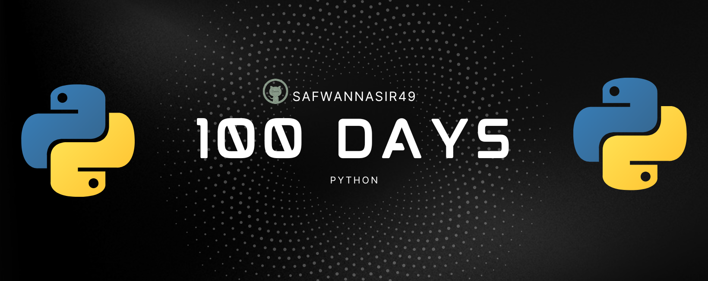

  

 
<h2 align="center">🔰 Beginner </h2> 

- [Day 1:](https://github.com/phillipai/100-days-of-code-python/tree/main/day01) Working with Variables in Python to Manage Data
- [Day 2:](https://github.com/phillipai/100-days-of-code-python/tree/main/day02) Understanding Data Types and How to Manipulate Strings
- [Day 3:](https://github.com/phillipai/100-days-of-code-python/tree/main/day03) Control Flow and Logical Operators
- [Day 4:](https://github.com/phillipai/100-days-of-code-python/tree/main/day04) Randomisation and Python Lists
- [Day 5:](https://github.com/phillipai/100-days-of-code-python/tree/main/day05) Python Loops
- [Day 6:](https://github.com/phillipai/100-days-of-code-python/tree/main/day06) Python Functions & Karel
- [Day 7:](https://github.com/phillipai/100-days-of-code-python/tree/main/day07) Hangman
- [Day 8:](https://github.com/phillipai/100-days-of-code-python/tree/main/day08) Function Parameters & Caesar Cipher
- [Day 9:](https://github.com/phillipai/100-days-of-code-python/tree/main/day09) Dictionaries, Nesting and the Secret Auction
- [Day 10:](https://github.com/phillipai/100-days-of-code-python/tree/main/day10) Functions with Outputs
- [Day 11:](https://github.com/phillipai/100-days-of-code-python/tree/main/day11) The Blackjack Capstone Project
- [Day 12:](https://github.com/phillipai/100-days-of-code-python/tree/main/day12) Scope & Number Guessing Game
- [Day 13:](https://github.com/phillipai/100-days-of-code-python/tree/main/day13) Debugging: How to Find and Fix Errors in your Code
- [Day 14:](https://github.com/phillipai/100-days-of-code-python/tree/main/day14) Higher Lower Game Project

<h2>Day 1: Working with Variables in Python to Manage Data</h2>
    <h3>Tasks:</h3>
    <ul>
        <li>Write a program that stores and prints variables.</li>
        <li>Practice with different variable types (e.g., integers, strings).</li>
        <li>Take user input and manipulate the data.</li>
    </ul>
    <h3>Reading List:</h3>
    <ul>
        <li>Introduction to Python variables and data types.</li>
        <li>Differences between static and dynamic typing.</li>
    </ul>
    <h3>Badge:</h3>
    
    <h2>Day 2: Understanding Data Types and How to Manipulate Strings</h2>
    <h3>Tasks:</h3>
    <ul>
        <li>Learn about Python's data types and type casting.</li>
        <li>Write a program to manipulate and format strings.</li>
    </ul>
    <h3>Reading List:</h3>
    <ul>
        <li>Explore string methods and operations in Python.</li>
    </ul>
    <h3>Badge:</h3>
    
    <h2>Day 3: Control Flow and Logical Operators</h2>
    <h3>Tasks:</h3>
    <ul>
        <li>Understand conditional statements (if, elif, else).</li>
        <li>Use logical operators to make decisions in code.</li>
    </ul>
    <h3>Reading List:</h3>
    <ul>
        <li>Introduction to control flow in Python.</li>
        <li>Logical operators: AND, OR, NOT.</li>
    </ul>
    <h3>Badge:</h3>
    
    <!-- Repeat for each day -->
    <h2>Day 4: Randomisation and Python Lists</h2>
    <h3>Tasks:</h3>
    <ul>
        <li>Use the random module to generate random numbers.</li>
        <li>Practice working with lists and accessing list elements.</li>
    </ul>
    <h3>Reading List:</h3>
    <ul>
        <li>Explore Python's random module.</li>
        <li>Learn about list operations.</li>
    </ul>
    <h3>Badge:</h3>
    
    <h2>Day 5: Python Loops</h2>
    <h3>Tasks:</h3>
    <ul>
        <li>Understand the use of `for` and `while` loops in Python.</li>
        <li>Write a program that uses loops to iterate over data.</li>
    </ul>
    <h3>Reading List:</h3>
    <ul>
        <li>Introduction to loops in Python.</li>
        <li>Difference between `for` and `while` loops.</li>
    </ul>
    <h3>Badge:</h3>
    
    <h2>Day 6: Python Functions & Karel</h2>
    <h3>Tasks:</h3>
    <ul>
        <li>Understand how to define and call functions.</li>
        <li>Explore Karel the robot to learn programming logic.</li>
    </ul>
    <h3>Reading List:</h3>
    <ul>
        <li>Introduction to functions in Python.</li>
        <li>Karel robot and programming concepts.</li>
    </ul>
    <h3>Badge:</h3>
    
    <h2>Day 7: Hangman</h2>
    <h3>Tasks:</h3>
    <ul>
        <li>Write a Python program to implement the Hangman game.</li>
        <li>Use loops, conditional statements, and string operations.</li>
    </ul>
    <h3>Reading List:</h3>
    <ul>
        <li>Understand how to use loops and conditions together for logic-based games.</li>
    </ul>
    <h3>Badge:</h3>
    
    <h2>Day 8: Function Parameters & Caesar Cipher</h2>
    <h3>Tasks:</h3>
    <ul>
        <li>Learn how to pass arguments to functions.</li>
        <li>Implement the Caesar Cipher encryption and decryption.</li>
    </ul>
    <h3>Reading List:</h3>
    <ul>
        <li>Explore Python function parameters.</li>
    </ul>
    <h3>Badge:</h3>
    
    <h2>Day 9: Dictionaries, Nesting and the Secret Auction</h2>
    <h3>Tasks:</h3>
    <ul>
        <li>Practice with dictionaries and nesting structures.</li>
        <li>Write a program to simulate a secret auction.</li>
    </ul>
    <h3>Reading List:</h3>
    <ul>
        <li>Learn about Python dictionaries and nested structures.</li>
    </ul>
    <h3>Badge:</h3>
    
    <h2>Day 10: Functions with Outputs</h2>
    <h3>Tasks:</h3>
    <ul>
        <li>Learn to define functions with return values.</li>
        <li>Practice returning different data types from functions.</li>
    </ul>
    <h3>Reading List:</h3>
    <ul>
        <li>Explore Python functions with return values.</li>
    </ul>
    <h3>Badge:</h3>
    
    <h2>Day 11: The Blackjack Capstone Project</h2>
    <h3>Tasks:</h3>
    <ul>
        <li>Write a Python program to simulate a Blackjack game.</li>
        <li>Use loops, functions, and conditionals to build the game logic.</li>
    </ul>
    <h3>Reading List:</h3>
    <ul>
        <li>Understand game logic and flow using Python functions.</li>
    </ul>
    <h3>Badge:</h3>
    
    <h2>Day 12: Scope & Number Guessing Game</h2>
    <h3>Tasks:</h3>
    <ul>
        <li>Understand global and local scope in Python.</li>
        <li>Write a number guessing game using functions and scope.</li>
    </ul>
    <h3>Reading List:</h3>
    <ul>
        <li>Introduction to Python scope and best practices.</li>
    </ul>
    <h3>Badge:</h3>
    
    <h2>Day 13: Debugging: How to Find and Fix Errors in your Code</h2>
    <h3>Tasks:</h3>
    <ul>
        <li>Learn techniques to identify and fix bugs in Python code.</li>
        <li>Practice debugging with a broken piece of code.</li>
    </ul>
    <h3>Reading List:</h3>
    <ul>
        <li>Introduction to debugging techniques.</li>
    </ul>
    <h3>Badge:</h3>
    
    <h2>Day 14: Higher Lower Game Project</h2>
    <h3>Tasks:</h3>
    <ul>
        <li>Write a Python program for the Higher Lower game.</li>
        <li>Use loops, conditionals, and logic for game mechanics.</li>
    </ul>
    <h3>Reading List:</h3>
    <ul>
        <li>Understand the design and logic behind guessing games.</li>
    </ul>
    <h3>Badge:</h3>
    

## 📚 Intermediate
- [Day 15:](https://github.com/phillipai/100-days-of-code-python/tree/main/day15) Local Development Environment Setup & the Coffee Machine
- [Day 16:](https://github.com/phillipai/100-days-of-code-python/tree/main/day16) Object Oriented Programming (OOP)
- [Day 17:](https://github.com/phillipai/100-days-of-code-python/tree/main/day17) The Quiz Project & The Benefits of OOP
- [Day 18:](https://github.com/phillipai/100-days-of-code-python/tree/main/day18) Turtle & the Graphical User Interface (GUI)
- [Day 19:](https://github.com/phillipai/100-days-of-code-python/tree/main/day19) Instances, State and Higher Order Functions
- [Day 20:](https://github.com/phillipai/100-days-of-code-python/tree/main/day20) Build the Snake Game Part 1: Animation & Coordinates
- [Day 21:](https://github.com/phillipai/100-days-of-code-python/tree/main/day21) Build the Snake Game Part 2: Inheritance & List Slicing
- [Day 22:](https://github.com/phillipai/100-days-of-code-python/tree/main/day22) Build Pong: The Famous Arcade Game
- [Day 23:](https://github.com/phillipai/100-days-of-code-python/tree/main/day23) The Turtle Crossing Capstone Project
- [Day 24:](https://github.com/phillipai/100-days-of-code-python/tree/main/day24) Files, Directories and Paths
- [Day 25:](https://github.com/phillipai/100-days-of-code-python/tree/main/day25) Working with CSV Data and the Pandas Library
- [Day 26:](https://github.com/phillipai/100-days-of-code-python/tree/main/day26) List Comprehension and the Nato Alphabet
- [Day 27:](https://github.com/phillipai/100-days-of-code-python/tree/main/day27) Tkinter, *args, **kwargs and Creating GUI Programs
- [Day 28:](https://github.com/phillipai/100-days-of-code-python/tree/main/day28) Tkinter, Dynamic Typing and the Pomodoro GUI Application
- [Day 29:](https://github.com/phillipai/100-days-of-code-python/tree/main/day29) Building a Password Manager GUI App with Tkinter
- [Day 30:](https://github.com/phillipai/100-days-of-code-python/tree/main/day30) Errors, Exceptions and JSON Data: Improving the Password Manager
- [Day 31:](https://github.com/phillipai/100-days-of-code-python/tree/main/day31) Flash Card App Capstone Project

## 👨‍💻 Intermediate+
- [Day 32:](https://github.com/phillipai/100-days-of-code-python/tree/main/day32) Send Email (smtplib) & Manage Dates (datetime) - Automated Birthday Wisher
- [Day 33:](https://github.com/phillipai/100-days-of-code-python/tree/main/day33) API Endpoints & API Parameters - ISS Overhead Notifier
- [Day 34:](https://github.com/phillipai/100-days-of-code-python/tree/main/day34) API Practice - Creating a GUI Quiz App
- [Day 35:](https://github.com/phillipai/100-days-of-code-python/tree/main/day35) Keys, Authentication & Environment Variables - Telegram Rain Notifier
- [Day 36:](https://github.com/phillipai/100-days-of-code-python/tree/main/day36) Stock Trading News Alert Project
- [Day 37:](https://github.com/phillipai/100-days-of-code-python/tree/main/day37) Habit Tracking Project: API Post Requests & Headers
- [Day 38:](https://github.com/phillipai/100-days-of-code-python/tree/main/day38) Workout Tracking Using Google Sheets
- [Day 39:](https://github.com/phillipai/100-days-of-code-python/tree/main/day39) Capstone Part 1: Flight Deal Finder
- [Day 40:](https://github.com/phillipai/100-days-of-code-python/tree/main/day40) Capstone Part 2: Flight Club
- [Day 41:](https://github.com/phillipai/100-days-of-code-python/tree/main/day41) Introduction to HTML
- [Day 42:](https://github.com/phillipai/100-days-of-code-python/tree/main/day42) Intermediate HTML
- [Day 43:](https://github.com/phillipai/100-days-of-code-python/tree/main/day43) Introduction to CSS
- [Day 44:](https://github.com/phillipai/100-days-of-code-python/tree/main/day44) Intermediate CSS
- [Day 45:](https://github.com/phillipai/100-days-of-code-python/tree/main/day45) Web Scraping with Beautiful Soup
- [Day 46:](https://github.com/phillipai/100-days-of-code-python/tree/main/day46) Create a Spotify Playlist Using The Musical Time Machine
- [Day 47:](https://github.com/phillipai/100-days-of-code-python/tree/main/day47) Create an Automated Amazon Price Tracker
- [Day 48:](https://github.com/phillipai/100-days-of-code-python/tree/main/day48) Selenium Webdriver Browser and Game Playing Bot
- [Day 49:](https://github.com/phillipai/100-days-of-code-python/tree/main/day49) Automating Job Applications on LinkedIn
- [Day 50:](https://github.com/phillipai/100-days-of-code-python/tree/main/day50) Auto Tinder Swiping Bot
- [Day 51:](https://github.com/phillipai/100-days-of-code-python/tree/main/day51) Internet Speed Twitter Complaint Bot
- [Day 52:](https://github.com/phillipai/100-days-of-code-python/tree/main/day52) Instagram Follower Bot
- [Day 53:](https://github.com/phillipai/100-days-of-code-python/tree/main/day53) Web Scraping Capstone - Data Entry Job Automation
- [Day 54:](https://github.com/phillipai/100-days-of-code-python/tree/main/day54) Introduction to Web Development with Flask
- [Day 55:](https://github.com/phillipai/100-days-of-code-python/tree/main/day55) HTML & URL Parsing in Flask and the Higher Lower Game
- [Day 56:](https://github.com/phillipai/100-days-of-code-python/tree/main/day56) Rendering HTML/Static Files and Using Website Templates
- [Day 57:](https://github.com/phillipai/100-days-of-code-python/tree/main/day57) Templating with Jinja in Flask Applications
- [Day 58:](https://github.com/phillipai/100-days-of-code-python/tree/main/day58) Web Foundation Boostrap

## 🏆 Advanced
- [Day 59:](https://github.com/phillipai/100-days-of-code-python/tree/main/day59) Blog Capstone Project Part 2 - Adding Styling
- [Day 60:](https://github.com/phillipai/100-days-of-code-python/tree/main/day60) Make POST Requests with Flask and HTML Forms
- [Day 61:](https://github.com/phillipai/100-days-of-code-python/tree/main/day61) Building Advanced Forms with Flask-WTForms
- [Day 62:](https://github.com/phillipai/100-days-of-code-python/tree/main/day62) Flask, WTForms, Bootstrap, and CSV - Coffee & Wifi Project
- [Day 63:](https://github.com/phillipai/100-days-of-code-python/tree/main/day63) Databases and with SQLite and SQLAlchemy
- [Day 64:](https://github.com/phillipai/100-days-of-code-python/tree/main/day64) My Top 10 Movies Website
- [Day 65:](https://github.com/phillipai/100-days-of-code-python/tree/main/day65) How to Create a Website That People Will Love
- [Day 66:](https://github.com/phillipai/100-days-of-code-python/tree/main/day66) Building Your Own API with RESTful Routing
- [Day 67:](https://github.com/phillipai/100-days-of-code-python/tree/main/day67) Blog Capstone Project Part 3 - RESTful Routing
- [Day 68:](https://github.com/phillipai/100-days-of-code-python/tree/main/day68) Authentication with Flask
- [Day 69:](https://github.com/phillipai/100-days-of-code-python/tree/main/day69) Blog Capstone Project Part 4 - Adding Users
- [Day 70:](https://github.com/phillipai/100-days-of-code-python/tree/main/day70) Deploying Your Web Application with Heroku
- [Day 71:](https://github.com/phillipai/100-days-of-code-python/tree/main/day71) Data Exploration with Pandas: College Major vs. Your Salary
- [Day 72:](https://github.com/phillipai/100-days-of-code-python/tree/main/day72) Data Visualisation with Matplotlib: Programming Languages
- [Day 73:](https://github.com/phillipai/100-days-of-code-python/tree/main/day73) Aggregate & Marge Data with Pandas: Analyse the Lego Dataset
- [Day 74:](https://github.com/phillipai/100-days-of-code-python/tree/main/day74) Google Trends Data: Resampling and Visualising Time Series
- [Day 75:](https://github.com/phillipai/100-days-of-code-python/tree/main/day75) Beautiful Plotly Charts & Analysing the Android App Store
- [Day 76:](https://github.com/phillipai/100-days-of-code-python/tree/main/day76) Computation with NumPy and N-Dimensional Arrays
- [Day 77:](https://github.com/phillipai/100-days-of-code-python/tree/main/day77) Linear Regression and Data Visualisation with Seaborn
- [Day 78:](https://github.com/phillipai/100-days-of-code-python/tree/main/day78) Analysing the Nobel Prize with Plotly, Matplotlib & Seaborn
- [Day 79:](https://github.com/phillipai/100-days-of-code-python/tree/main/day79) The Tragic Discovery of Handwashing: t-Tests & Distributions
- [Day 80:](https://github.com/phillipai/100-days-of-code-python/tree/main/day80) Capstone Project - Predict House Prices

## ⚔ Professional Portfolio Projects
- [Day 81:](https://github.com/phillipai/100-days-of-code-python/tree/main/day81) Text to Morse Code Converter
- [Day 82:](https://github.com/phillipai/100-days-of-code-python/tree/main/day82) Portfolio Website
- [Day 83:](https://github.com/phillipai/100-days-of-code-python/tree/main/day83) Tic Tac Toe
- [Day 84:](https://github.com/phillipai/100-days-of-code-python/tree/main/day84) Image Watermarking Desktop App
- [Day 85:](https://github.com/phillipai/100-days-of-code-python/tree/main/day85) Typing Speed Test App
- [Day 86:](https://github.com/phillipai/100-days-of-code-python/tree/main/day86) Breakout: The Famous Arcade Game
- [Day 87:](https://github.com/phillipai/100-days-of-code-python/tree/main/day87) Cafe and Wifi Website
- [Day 88:](https://github.com/phillipai/100-days-of-code-python/tree/main/day88) To Do Agenda App
- [Day 89:](https://github.com/phillipai/100-days-of-code-python/tree/main/day89) Disappearing Text Writing App
- [Day 90:](https://github.com/phillipai/100-days-of-code-python/tree/main/day90) Convert PDF to Audiobook
- [Day 91:](https://github.com/phillipai/100-days-of-code-python/tree/main/day91) Image to Color List
- [Day 92:](https://github.com/phillipai/100-days-of-code-python/tree/main/day92) Amazon Canada Web Scraper
- [Day 93:](https://github.com/phillipai/100-days-of-code-python/tree/main/day93) Google Dinosaur Game Bot
- [Day 94:](https://github.com/phillipai/100-days-of-code-python/tree/main/day94) Space Invaders
- [Day 95:](https://github.com/phillipai/100-days-of-code-python/tree/main/day95) Custom API
- [Day 96:](https://github.com/phillipai/100-days-of-code-python/tree/main/day96) An Online Shop
- [Day 97:](https://github.com/phillipai/100-days-of-code-python/tree/main/day97) Percentage Calculator
- [Day 98:](https://github.com/phillipai/100-days-of-code-python/tree/main/day98) Analyzing and Visualizing the Space Race
- [Day 99:](https://github.com/phillipai/100-days-of-code-python/tree/main/day99) Analyzing Deaths Involving Police in the United States
- [Day 100:](https://github.com/phillipai/100-days-of-code-python/tree/main/day100) Predicting Earnings using Multivariable Regression

## ⚙ Tools and Technologies Covered
- Python 3
- PyCharm, Jupyter Notebook, Google Colab
- Python Scripting and Automation
- Python Game Development
- Web Scraping
- Beautiful Soup
- Selenium Web Driver
- Request
- WTForms
- Data Science
- Pandas
- NumPy
- Matplotlib
- Plotly
- Scikit learn
- Seaborn
- Turtle
- Python GUI Desktop App Development
- Tkinter
- Front-End Web Development
- HTML 5
- CSS 3
- Bootstrap 4
- Bash Command Line
- Git, GitHub and Version Control
- Backend Web Development
- Flask
- REST
- APIs
- Databases
- SQL
- SQLite
- PostgreSQL
- Authentication
- Web Design
- Deployment with GitHub Pages, Heroku and GUnicorn

